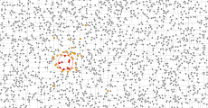
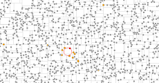

# KDTree

Javascript library for creating 
[*k*-d trees](https://en.wikipedia.org/wiki/K-d_tree). 

### Examples

<table>
  <tr>
    <td>
      k-NN Search <br>
      <a href="http://bl.ocks.org/armollica/1593f53c0c8346d067491f39255d0b84"></a>
    </td>
    <td>
      1-NN Search <br>
      <a href="http://bl.ocks.org/armollica/64ffc3bd8fc76c5657719a842e39c4e3"></a>
    </td>
  </tr>
</table>

### API Reference

*#* **KDTree**()

Creates a new *k*-d tree `generator`.

*#* **generator**(*data*)

Partitions the points in the array `data` into a *k*-d tree of `node`s. 
The returned tree will be the root `node` that contains all other `node`s as
"ancestors."

*#* generator.**accessor**([callback])

Sets the *point*-accessor function for the generator. The callback should 
return a *k*-dimensional point as an array of length *k*. If `callback` is
not specified, it return the current *point*-accessor function. Defaults to:
```function(d) { return d; }```

*#* **node**

The *k*-d tree generator returns a tree of nodes. Each `node` has four properties:
- `location`: position of the node (array of length *k*)
- `axis`: axis the node splits (integer < k)
- `datum`: data object associated with this node from the original `data` array
- `subnodes`: array of children nodes where `subnodes[0]` is the left child and `subnodes[1]` is the right child 

*#* node.**find**(*point*, [*k*])

Finds the *k*-nearest neighbors of the specified point. Returns an
array of `node`s. *k* defaults to 1.

*#* node.**flatten**()

Returns this `node` and all of its ancestors as a flat array of `node`s.

*#* node.**toArray**()

Returns this `node` and its ancestors as a nested array.

*#* node.**lines**(*extent*)

Returns an array of points denoting the lines that partition the `node`s. This
currently only works when *k* is 2. The *extent* defines how far these lines
go. It's specified as [[*x0*, *y0*],[*x1*,*y1*]] where *x0* and *y0* are the
lower bounds and *x1* and *y1* are the upper bounds.
